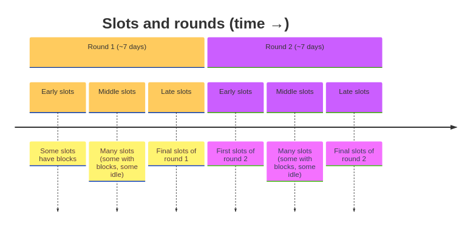
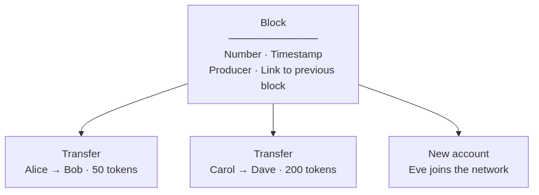
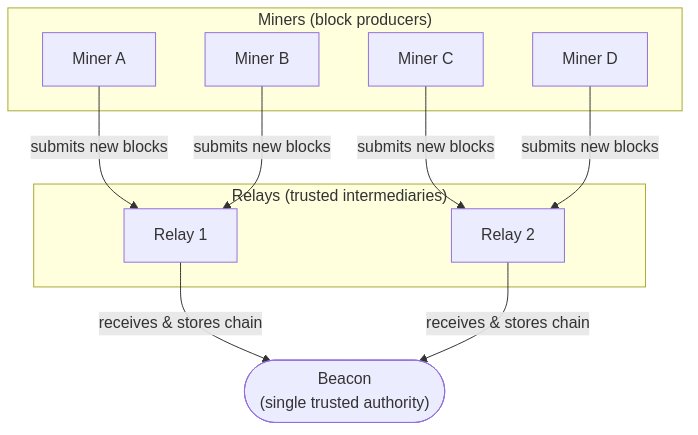
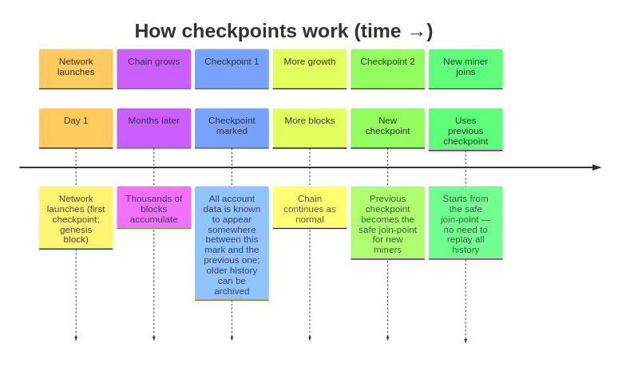
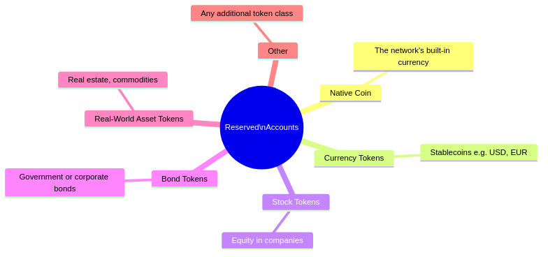
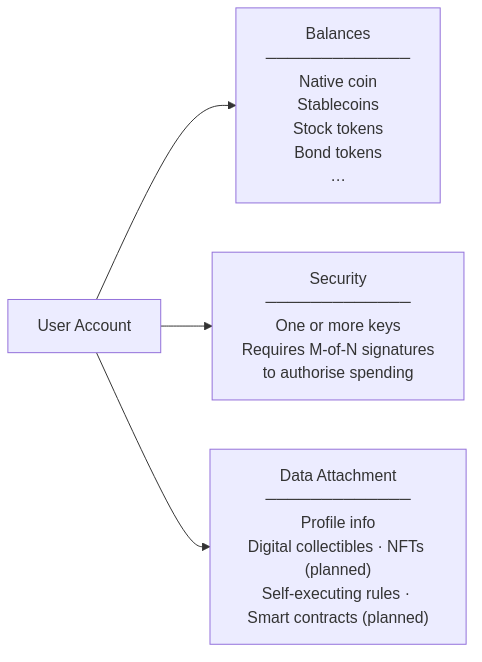

## 1. 链：时间、区块与轮次

时间链将网络活动组织成固定的节奏。每 **5 秒** 为一个「拍」（称为 **时隙 slot**）。在每个时隙内，一名被选中的参与者可以向链上添加一批活动（即一个 **区块 block**）。固定数量的时隙（目前约为 **7 天**）组成一 **轮**（称为 **epoch**），每轮结束时选出下一轮的参与者。

| 概念 | 含义 |
|------|------|
| 拍（时隙 slot） | 5 秒的时间窗，每个时隙最多添加一个区块。 |
| 轮（epoch） | 7 天。每轮结束时按质押权重选出下一轮的区块生产者。 |
| 区块 | 经密封的一批活动：转账、账户变更等记录，并链接到前一个区块。 |

---

## 2. 区块里有什么

每个区块相当于一个防篡改的信封，一旦上链即不可更改。

**区块可记录的活动类型**

| 活动 | 说明 |
|------|------|
| 启动 | 首次搭建网络 |
| 新账户 | 注册并为新参与者注资 |
| 转账 | 在账户之间转移代币 |
| 更新账户 | 参与者更新自己的资料 |
| 续期账户 | 网络维持账户有效 |
| 关闭账户 | 网络关闭无法继续支付维护费的账户 |

---

## 3. 网络参与者：校准节点、中继节点 与 记账节点

三类节点共同维持网络运行，角色清晰、互不重叠，因此没有单一参与者能独自篡改链。若原始校准节点失灵，任一持有完整链的中继节点均可被指定为新的校准节点，保持连续性。

| 角色 | 职责 | 是否出块 | 是否持有完整历史 |
|------|------|:---:|:---:|
| **校准节点** | 唯一权威账本；校验一切 | 否 | 是 |
| **中继节点** | 可信网关，向记账节点分发链数据，分压校准节点 | 否 | 是 |
| **记账节点** | 被选中的参与者，打包并提交新交易区块；获得费用 | 是 | 部分 |

> **意义：** 矿工公平竞争——每个时隙只有随机选出的矿工可以出块，当选概率与其质押量成正比，使网络既去中心化又可预期。

---

## 4. 存档点：保持网络轻量化

随着链在数月、数年中增长，从创世块起长期存储所有区块成本高昂。**存档点** 解决这一问题：从启动日起，网络标记已确认的区块区间，这些区间的内容共同决定每个账户的当前状态。第一个存档点即网络启动；后续存档点覆盖相邻两个标记之间的区间。新参与者可从某个存档点加入，只需读取该存档点与上一存档点之间的区块，而无需重放全部历史。

| 术语 | 含义 |
|------|------|
| 快照（存档点） | 链上的一个标记，保证从该标记与上一标记之间的区块即可重建每个账户的最新状态（状态不必位于单个区块内） |
| 安全接入点 | 最新存档点之前的一个存档点，已证明稳定且被广泛认可 |

---

## 5. 预留账户：发行代币

链上预留一批特殊账户用于发行和管理代币。这些账户可显示负余额（类似央行资产负债表），并可创建新的代币类型。

| 账户 | 用途 |
|------|------|
| 创世账户（账户 0） | 发行网络原生代币，设定初始供应 |
| 费用归集（账户 1） | 收取各账户支付的小额维护费 |
| 储备（账户 2） | 持有未分配供应 |
| 回收（账户 3） | 接收被关闭账户的余额 |
| 账户 4 及以上 | 用于货币、股票、债券、RWA 及其他代币类别 |

> 每种代币由各自专用的预留账户发行，发行在链上有清晰、可审计的归属。

---

## 6. 用户账户：持有与使用

链上的每个个人或机构拥有一个 **用户账户**。账户可持有多种代币（原生币、稳定币、权益、债券等），并可携带可扩展的个人数据附件，未来可包含数字藏品与自执行合约。

{width=50%}

| 功能 | 当前是否支持 |
|------|:---:|
| 持有多种代币 | 是 |
| 多签消费（M-of-N） | 是 |
| 附加资料或自定义数据 | 是 |
| 持有数字藏品（NFT） | 规划中 |
| 自执行规则（智能合约） | 规划中 |

---

## 7. 功能与规划

### 核心链

| 功能 | 状态 |
|------|------|
| 可预期、基于时间的出块 | 已上线 |
| 基于质押、防篡改的领导者选举 | 已上线 |
| 不可篡改的交易记录 | 已上线 |
| 多代币余额 | 已上线 |
| 小额、按使用计费 | 已上线 |
| 定期检查点以保持存储轻量 | 已上线 |

### 网络

| 功能 | 状态 |
|------|------|
| 校准节点：权威账本 | 已上线 |
| 中继节点：可扩展矿工网关 | 已上线 |
| 记账节点：去中心化出块 | 已上线 |
| 矿工通过快照快速加入 | 已上线 |

> **安全说明：** 当前网络栈侧重正确性与完整性。针对大规模滥用行为（如大规模连接洪泛或自动化探测）的高级防护尚未实现，在面向公网部署前需进一步加固。

### 代币与账户

| 功能 | 状态 |
|------|------|
| 原生代币 | 已上线 |
| 预留账户的自定义代币发行 | 已上线 |
| 用户账户注册 | 已上线 |
| 账户维护与关闭 | 已上线 |
| 数字藏品（NFT） | 规划中 |
| 自执行规则（智能合约） | 规划中 |
| 专用货币 / 股票 / 债券 / RWA 代币类别 | 规划中 |

### 接口

| 功能 | 状态 |
|------|------|
| 命令行工具 | 已上线 |
| REST（HTTP）API | 已上线 |
| JavaScript / Node.js 库 | 已上线 |
| MCP（Model Context Protocol）服务端 | 已上线 |
| 实时流式 API | 规划中 |
| Web 浏览器 / 后台监测 | 规划中 |
