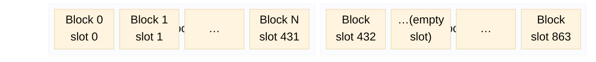
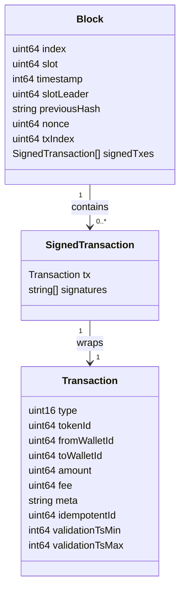
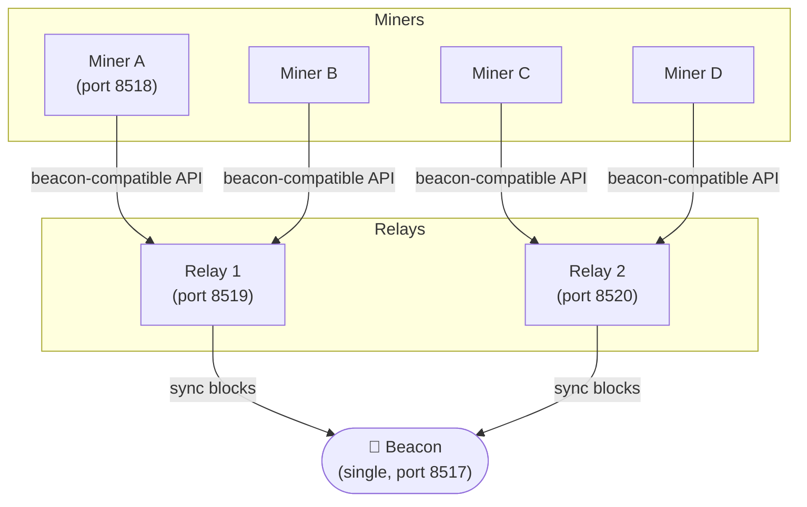
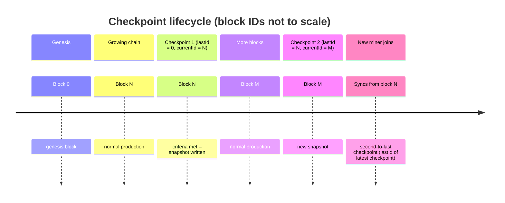
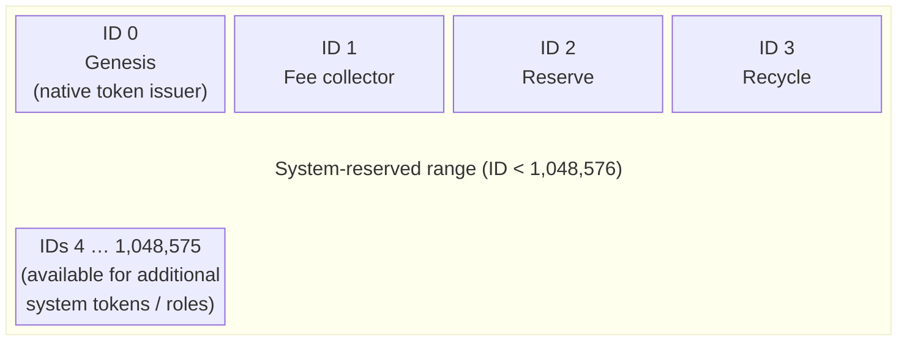
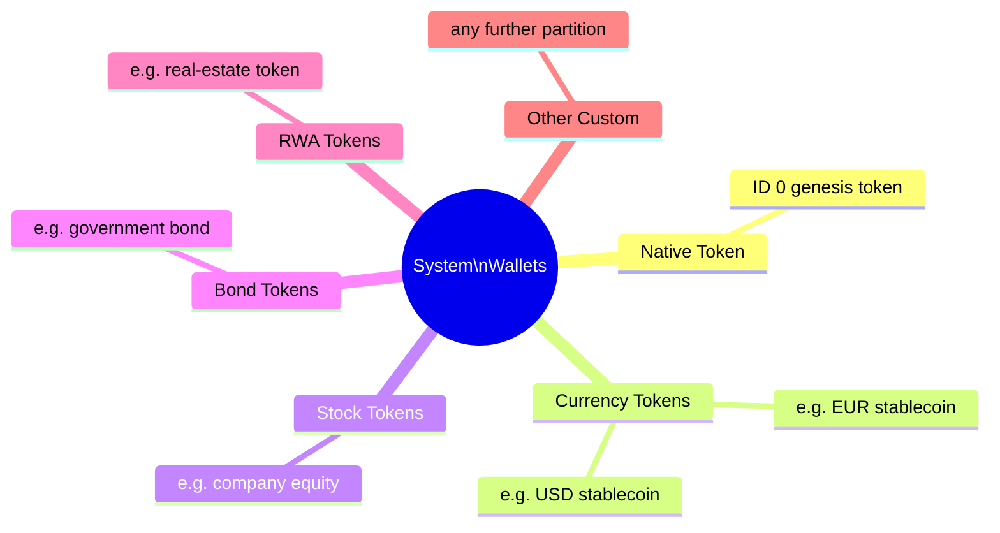
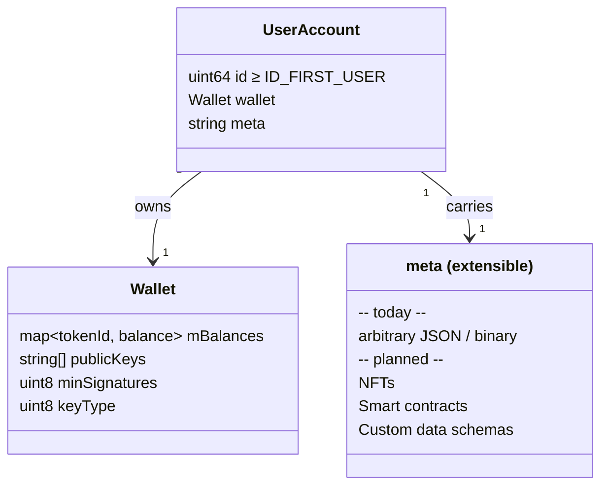

# Time Chain

## 1. Chain: Slots, Blocks, and Epochs

Time is divided into fixed-duration **slots** (default 5 s). Every `slotsPerEpoch` slots (default 432 = 36 min) form an **epoch**. Each slot has at most one block; empty slots produce no block.

**Key relationships**

| Concept | Detail |
|---------|--------|
| Slot | Smallest time unit (`slotDuration` seconds). At most one block per slot. |
| Epoch | `slotsPerEpoch` consecutive slots. Slot leaders are chosen per epoch using VRF + stake. |
| Block | Carries a slot number, previous-block hash, slot-leader wallet ID, and a list of signed transactions. |

---

## 2. Block Structure

**Transaction types**

| Type | Constant | Purpose |
|------|----------|---------|
| 1 | `T_GENESIS` | Initialize the system (genesis block) |
| 2 | `T_NEW_USER` | Fund / register a new user account |
| 3 | `T_CONFIG` | Update blockchain config |
| 4 | `T_USER` | User updates their own account info |
| 5 | `T_RENEWAL` | Miner renews an account (keeps it active) |
| 6 | `T_END_USER` | Miner terminates account (insufficient fee) |

---

## 3. Beacon, Relay, and Miners

There is exactly **one beacon** per network. Miners connect through one or more **relays**; relays forward to the beacon. The beacon never talks directly to untrusted miners.

**Roles**

| Node | Produces blocks | Stores full chain | Exposed to untrusted miners |
|------|:-:|:-:|:-:|
| Beacon | ✗ | ✓ | ✗ |
| Relay | ✗ | ✓ | ✓ |
| Miner | ✓ | partial | ✓ |

---

## 4. Checkpoints

A checkpoint is created when the stored chain data exceeds `minBlocks` blocks and those blocks are older than `minAgeSeconds`. Miners may start syncing from the **second-to-last checkpoint** (i.e. `checkpoint.lastId`) rather than from genesis, avoiding the need to replay the full history.

**Checkpoint struct**

| Field | Meaning |
|-------|---------|
| `lastId` | Block ID of the previous checkpoint (miner sync start) |
| `currentId` | Block ID of this checkpoint |

---

## 5. System Reserved Wallets

Wallet IDs below `ID_FIRST_USER` (`1 << 20 = 1,048,576`) are **system reserved**. They are allowed to carry negative balances for accounting purposes and can issue tokens.

**Token partitioning** – each system wallet that acts as a token issuer can be dedicated to a token class:

Tokens are distinguished at runtime by `tokenId` (the issuing wallet ID). A transaction with `tokenId = 0` uses the native genesis token; any other value references a custom token issued by that system wallet.

---

## 6. User Wallets

User wallet IDs start at `ID_FIRST_USER` (`1,048,576`). Each account is an `AccountBuffer::Account` carrying a `Client::Wallet`.

**Capabilities**

| Feature | Status |
|---------|--------|
| Multi-token balances | ✓ implemented |
| Multi-key / threshold signatures | ✓ implemented |
| Arbitrary `meta` field | ✓ implemented |
| NFT ownership records | planned |
| Smart contract storage | planned |
| Custom data schemas | planned |

---

## 7. Implementation Status

### Core Protocol

| Area | Component | Status |
|------|-----------|--------|
| Consensus | Ouroboros slot/epoch timing | ✅ done |
| Consensus | VRF-based slot-leader selection | ✅ done |
| Consensus | Stake-weighted election | ✅ done |
| Ledger | Block production & validation | ✅ done |
| Ledger | Persistent storage (FileStore / DirStore) | ✅ done |
| Ledger | Multi-token balances | ✅ done |
| Ledger | Transaction fee calculation (quadratic) | ✅ done |
| Checkpoints | Create / detect / reinitialize from checkpoint | ✅ done |

### Nodes

| Node | Feature | Status |
|------|---------|--------|
| Beacon | Full chain archival | ✅ done |
| Beacon | Checkpoint management | ✅ done |
| Relay | Sync from beacon, expose beacon API | ✅ done |
| Relay | DHT participation | ✅ done |
| Miner | Block production loop | ✅ done |
| Miner | Transaction pool | ✅ done |
| Miner | Reinit from checkpoint | ✅ done |

### Accounts & Tokens

| Feature | Status |
|---------|--------|
| System reserved wallets (IDs 0–3) | ✅ done |
| Native genesis token | ✅ done |
| Custom token issuance (by system wallets) | ✅ done |
| User wallet registration (`T_NEW_USER`) | ✅ done |
| Account renewal / termination | ✅ done |
| NFT support | ⬜ not started |
| Smart contracts | ⬜ not started |
| Currency / stock / bond / RWA token partitioning | ⬜ convention only |

### Interfaces & Tooling

| Feature | Status |
|---------|--------|
| TCP client/server (FetchClient/FetchServer) | ✅ done |
| CLI (`pp-client`) | ✅ done |
| HTTP API proxy (`pp-http`) | ✅ done |
| Node.js native addon | ✅ done |
| WebSocket / streaming API | ⬜ not started |
| Explorer UI | ⬜ not started |
