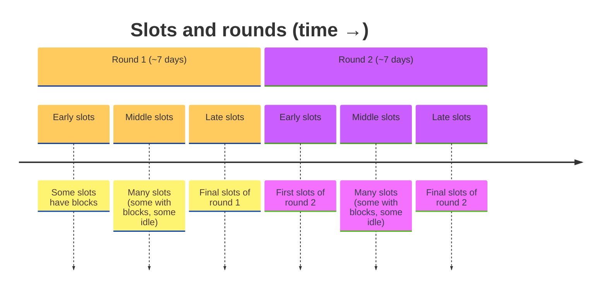
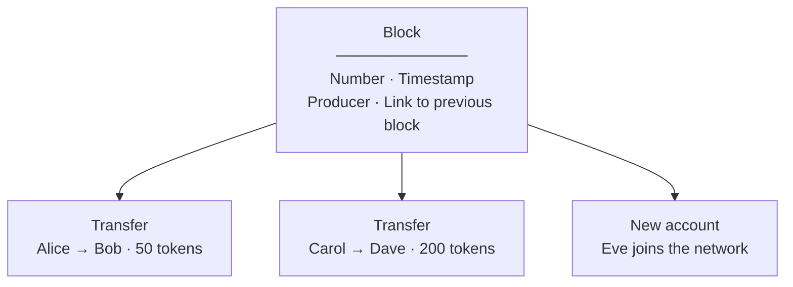
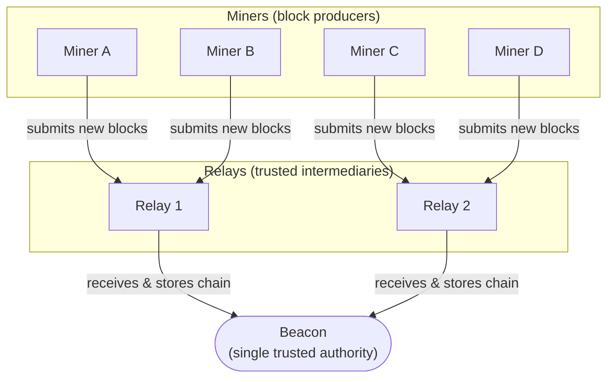
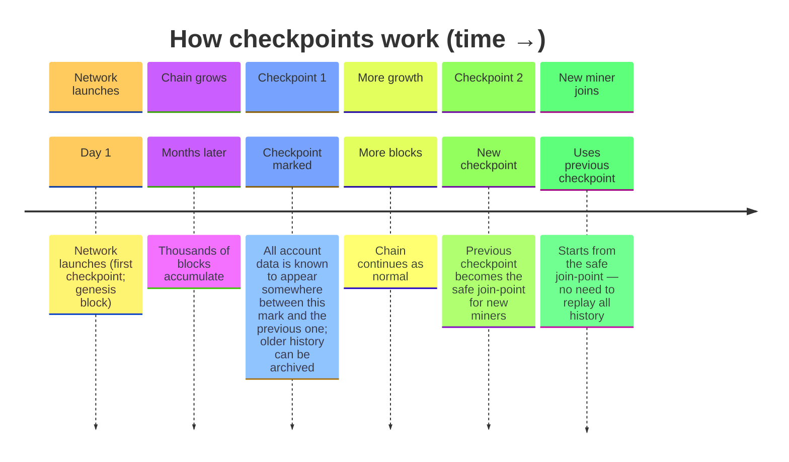
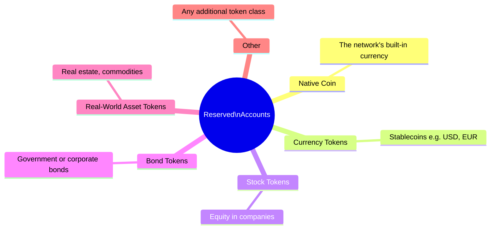
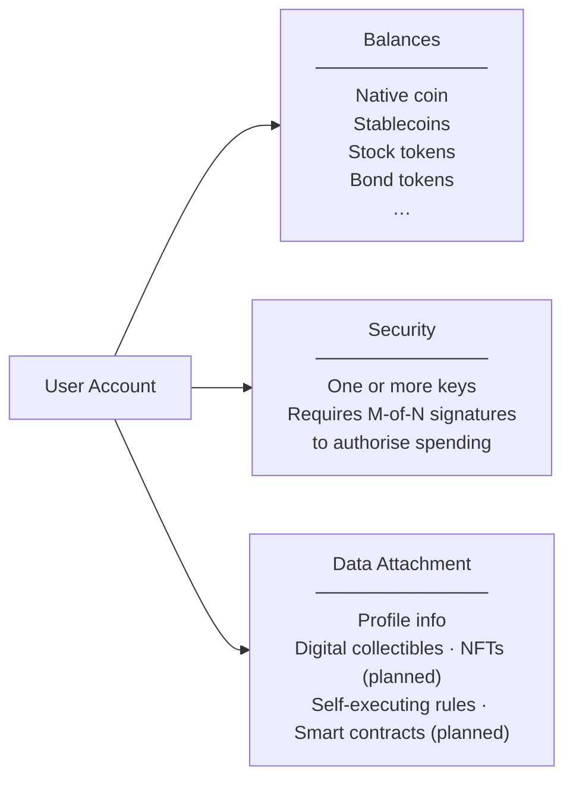

# Time Chain

## 1. The Chain: Time, Blocks, and Rounds

The Time Chain organises activity into a fixed heartbeat. Every **5 seconds** one "tick" (called a **slot**) passes. During each tick, one elected participant may add a bundle of activity (a **block**) to the chain. A fixed number of ticks (currently about **7 days** of slots) forms a **round** (called an **epoch**) at the end of which participants for the next round are elected.

| Concept | Plain meaning |
|---------|---------------|
| Tick (slot) | 5-second window. At most one block is added per tick. |
| Round (epoch) | 7 days. Block producers for the next round are chosen at the end of each round, weighted by their stake. |
| Block | A sealed package of activity: transfers, account changes, and other records — linked to the block before it. |

---

## 2. What Is Inside a Block

Each block is a tamper-proof envelope. Once added to the chain it cannot be changed.

**Types of activity a block can record**

| Activity | What it does |
|----------|-------------|
| Launch | Sets up the network for the first time |
| New account | Registers and funds a new participant |
| Transfer | Moves tokens between accounts |
| Update account | Participant updates their own profile |
| Renew account | Network keeps an account active |
| Close account | Network closes an account that can no longer pay its upkeep |

---

## 3. Network Participants: Beacon, Relays, and Miners

Three types of node keep the network running. They have distinct, non-overlapping roles so that no single participant can act alone to alter the chain. In the rare event that the original Beacon is permanently lost, a Relay that already holds the full chain can be promoted to become the new Beacon, preserving continuity.

| Role | What they do | Adds blocks? | Sees full history? |
|------|-------------|:---:|:---:|
| **Beacon** | Single authoritative record-keeper; validates everything | ✗ | ✓ |
| **Relay** | Trusted gateway — distributes the chain to miners, shields the Beacon | ✗ | ✓ |
| **Miner** | Elected participant who packages and adds new blocks; earns fees | ✓ | partial |

> **Why this matters:** Miners compete fairly — only the randomly elected miner for a given tick may add a block, and their election odds are proportional to how much they have staked. This makes the network both decentralised and predictable.

---

## 4. Checkpoints — Keeping the Network Lean

As the chain grows over months and years, storing every block from the very beginning becomes expensive.
**Checkpoints** solve this: starting from launch day, the network marks confirmed ranges of blocks whose combined contents fully determine the current state of every account.
The first checkpoint is the network launch itself; later checkpoints cover ranges between two neighbouring marks.
New participants can join from a checkpoint and only need to read the blocks between that checkpoint and the previous one, instead of replaying the entire history.

| Term | Meaning |
|------|---------|
| Snapshot (checkpoint) | A marker in the chain that guarantees every account's latest state can be reconstructed from the blocks between this mark and the previous one (states are not required to sit in a single block) |
| Safe join-point | The checkpoint before the latest one — proven stable and widely agreed upon |

---

## 5. Reserved Accounts — Issuing Tokens

The network reserves a range of special accounts for issuing and managing tokens. These accounts are allowed to show negative balances as an accounting device (similar to a central bank's balance sheet) and can create new token types.

| Account | Purpose |
|---------|---------|
| Genesis (account 0) | Issues the network's native coin; sets initial supply |
| Fee collector (account 1) | Receives small upkeep fees paid by all accounts |
| Reserve (account 2) | Holds unallocated supply |
| Recycle (account 3) | Receives balances from closed accounts |
| Accounts 4 and above | Available for currency, stock, bond, RWA, and other token classes |

> Each token type is issued from its own dedicated reserved account, giving issuance a clear, auditable home on-chain.

---

## 6. User Accounts — Holding and Doing

Every person or organisation on the network has a **user account**. An account can hold any mix of tokens (native coin, stablecoins, equity, bonds, etc.) and carry a personal data attachment that can grow to include digital collectibles and self-executing contracts.

| Capability | Available today |
|------------|:---:|
| Hold multiple token types | ✓ |
| Require more than one key to spend (multi-sig) | ✓ |
| Attach profile or custom data | ✓ |
| Own digital collectibles (NFTs) | Planned |
| Self-executing rules (smart contracts) | Planned |

---

## 7. What Is Built and What Is Next

### Core Chain

| Capability | Status |
|------------|--------|
| Predictable, time-based block production | ✅ Live |
| Stake-weighted, tamper-proof leader election | ✅ Live |
| Immutable transaction records | ✅ Live |
| Multi-token balances | ✅ Live |
| Small, usage-based fees | ✅ Live |
| Periodic checkpoints to keep storage lean | ✅ Live |

### Network

| Capability | Status |
|------------|--------|
| Beacon — authoritative record-keeper | ✅ Live |
| Relays — scalable miner gateway | ✅ Live |
| Miners — decentralised block production | ✅ Live |
| Miner fast-join via snapshots | ✅ Live |

> **Security note:** The current network stack focuses on correctness and basic robustness.
> Advanced protections against large-scale abusive behaviour (such as massive connection floods or automated probing)
> are not yet implemented and should be assumed to require additional hardening before internet-wide deployment.

### Tokens & Accounts

| Capability | Status |
|------------|--------|
| Native coin | ✅ Live |
| Custom token issuance (by reserved accounts) | ✅ Live |
| User account registration | ✅ Live |
| Account upkeep and closure | ✅ Live |
| Digital collectibles (NFTs) | ⬜ Planned |
| Self-executing rules (smart contracts) | ⬜ Planned |
| Dedicated currency / stock / bond / RWA token classes | ⬜ Planned |

### Interfaces

| Capability | Status |
|------------|--------|
| Command-line tool | ✅ Live |
| REST (HTTP) API | ✅ Live |
| JavaScript / Node.js library | ✅ Live |
| MCP (Model Context Protocol) server | ✅ Live |
| Real-time streaming API | ⬜ Planned |
| Web explorer / dashboard | ⬜ Planned |
