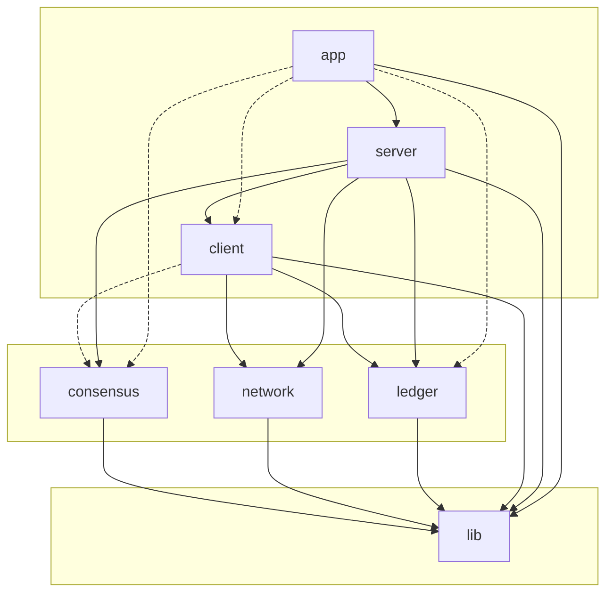

# Folder dependency graph

This document describes how the main source folders in **pp-ledger** depend on each other (build and `#include` dependencies). Test subfolders are not shown.

## Diagram (Mermaid)

- **Solid arrows**: direct CMake `target_link_libraries` (and include) dependency.
- **Dashed arrows**: include-only dependency (e.g. `app` and `client` use consensus types via includes; `client` does not link `pp_consensus` in CMake).

## Layer summary

| Layer | Folders | Depends on |
|-------|---------|------------|
| **1 – Base** | `lib` | — |
| **2 – Core** | `consensus`, `network`, `ledger` | `lib` |
| **3 – Services** | `client`, `server` | `lib` + core; `client` also uses `consensus` (types); `server` uses all of `client`, `consensus`, `network`, `ledger` |
| **4 – Entrypoints** | `app` | `lib`, `server`; executables also use `client`, `ledger`, `consensus` as needed |

## Per-folder dependencies

| Folder | Depends on | Notes |
|--------|------------|--------|
| **lib** | — | Logger, Module, Service, ResultOrError, Serialize, BinaryPack, Utilities; OpenSSL, nlohmann/json |
| **consensus** | lib | Ouroboros, EpochManager, SlotTimer, SlotLeaderSelection |
| **network** | lib | TcpServer/Client/Connection, FetchServer/Client, BulkWriter |
| **ledger** | lib | Ledger, DirStore, FileStore, DirDirStore, FileDirStore |
| **client** | lib, ledger, network | Client; also includes consensus/Types.hpp (no pp_consensus link in CMake) |
| **server** | lib, ledger, client, consensus, network | Beacon, Miner, Relay, Chain, Servers |
| **app** | lib, server | Executables: pp-beacon, pp-relay, pp-miner link pp_server; pp-client links pp_client, pp_ledger |

## Root CMake order

The root `CMakeLists.txt` adds subdirectories in dependency order:

1. `lib`
2. `consensus`
3. `network`
4. `client`
5. `ledger`
6. `server`
7. `app`

This order respects the folder dependency graph above.
