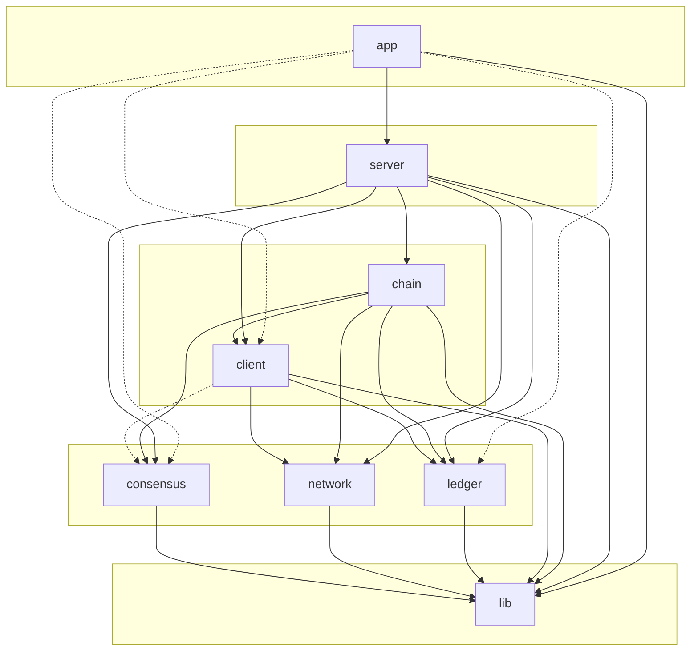

# Folder dependency graph

This document describes how the main source folders in **pp-ledger** depend on each other (build and `#include` dependencies). The diagram omits test subfolders; see **Tests** below.

## Diagram (Mermaid)

```mermaid
flowchart TD
    subgraph base[" "]
        lib["lib"]
    end

    subgraph core[" "]
        consensus["consensus"]
        network["network"]
        ledger["ledger"]
    end

    subgraph services[" "]
        client["client"]
        chain["chain"]
    end

    subgraph servers[" "]
        server["server"]
    end

    subgraph apps[" "]
        app["app"]
    end

    consensus --> lib
    network --> lib
    ledger --> lib

    client --> lib
    client --> ledger
    client --> network
    client -.-> consensus

    chain --> lib
    chain --> ledger
    chain --> client
    chain --> consensus
    chain --> network

    server --> lib
    server --> ledger
    server --> client
    server --> consensus
    server --> network
    server --> chain

    app --> lib
    app --> server
    app -.-> client
    app -.-> ledger
    app -.-> consensus
```

- **Solid arrows**: direct CMake `target_link_libraries` dependency (and typical `#include` use).
- **Dashed arrows**: include-only dependency (e.g. `app` and `client` use consensus types via headers; `client` does not link `pp_consensus` in CMake).

**Notes**

- **`chain`** is the `pp_chain` static library: `Chain`, `AccountBuffer`, chain config types, and transaction helper modules (`ChainTx*`).
- **`server`** still links `lib`, `ledger`, `client`, `consensus`, and `network` directly because Beacon / Miner / Relay code includes those headers for TCP, DHT, and consensus types, in addition to linking **`pp_chain`** for chain state and validation.

## Tests

| Location | Linked targets | Purpose |
|----------|----------------|---------|
| `chain/test/` | `pp_chain`, gtest | `test_chain`, `test_account_buffer` |

Other component tests remain under their folders (e.g. `lib/common/test`, `ledger/test`, `network/test`).

## Layer summary

| Layer | Folders | Depends on |
|-------|---------|------------|
| **1 – Base** | `lib` | — |
| **2 – Core** | `consensus`, `network`, `ledger` | `lib` |
| **3 – Client API** | `client` | `lib` + core; also uses `consensus` (types, no link) |
| **4 – Chain domain** | `chain` | `lib`, `ledger`, `client`, `consensus`, `network` |
| **5 – Servers** | `server` | `chain` and the same core/client stack as before (direct links plus `pp_chain`) |
| **6 – Entrypoints** | `app` | `lib`, `server`; some executables also use `client`, `ledger`, `consensus` as needed |

## Per-folder dependencies

| Folder | Depends on | Notes |
|--------|------------|--------|
| **lib** | — | Logger, Module, Service, ResultOrError, Serialize, BinaryPack, Utilities; libsodium, nlohmann/json |
| **consensus** | lib | Ouroboros, EpochManager, SlotTimer, SlotLeaderSelection |
| **network** | lib | TcpServer/Client/Connection, FetchServer/Client, BulkWriter, DHT |
| **ledger** | lib | Ledger, DirStore, FileStore, DirDirStore, FileDirStore |
| **client** | lib, ledger, network | Client; also includes `consensus/Types.hpp` (no `pp_consensus` link in CMake) |
| **chain** | lib, ledger, client, consensus, network | `pp_chain`: Chain, AccountBuffer, `Tx*`, Types, handler interface |
| **server** | lib, ledger, client, consensus, network, **chain** | Beacon, Miner, Relay, `Server*` facades; no longer builds Chain sources here |
| **app** | lib, server | `pp-beacon`, `pp-relay`, `pp-miner` link `pp_server`; `pp-client` links `pp_client`, `pp_ledger` |

## Root CMake order

The root `CMakeLists.txt` adds subdirectories in dependency order:

1. `lib`
2. `consensus`
3. `network`
4. `client`
5. `ledger`
6. **`chain`**
7. `server`
8. `app`

This order respects the folder dependency graph above (`chain` before `server`).
