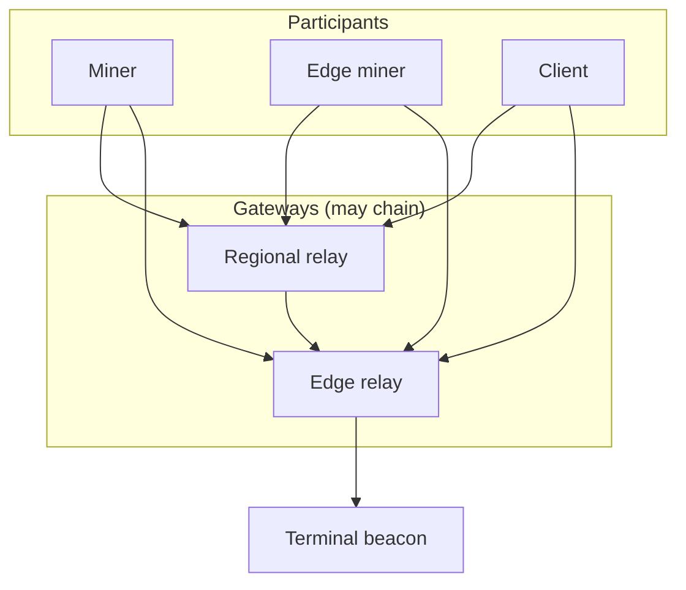

# Ledger network topology — design guidance

**Status:** agreed long-term guidance (2026-09-02).  
**Scope:** beacon / gateway / miner interaction over the fleet ledger RPC, independent of
transport binding (AMP today; libp2p at the pp-browser edge per
[platform-integration.md](platform-integration.md)).  
**Related:** [design.md](design.md) (roles & consensus), [amp-transport.md](amp-transport.md)
(wire format & config field names), [name-directory.md](name-directory.md) (DomainIndex /
NameIndex — future terminal-owned registries).

This document is **normative guidance** for making the chain protocol robust, efficient, and
reliable. Implementation may lag; new work should move toward these properties rather than
away from them.

---

## 1. Problem statement

The fleet has three operational roles — **terminal beacon**, **gateway**, and **miner** — but
participants on the wire must not need to know which role they reached. Gateways may chain;
miners may run at the edge; ops may insert or move hops without reconfiguring client logic.

Robustness therefore cannot depend on peer **role labels**. It depends on:

1. A single terminal authority for canonical state.
2. A uniform RPC surface at every hop.
3. Cryptographic chain validation at every node.
4. Explicit **realization** semantics for mutations.
5. Multi-upstream consistency checks where participants configure more than one endpoint.

---

## 2. Terminology

| Term | Meaning |
|------|---------|
| **Terminal beacon** | The sole node that commits canonical chain state and the authoritative stakeholder registry. Often on a private network; not required to be reachable from the public internet. |
| **Gateway** | Any node that exposes the fleet ledger RPC downstream and has an upstream path toward the terminal (`pp-relay`, edge relay, pp-node, …). Gateways cache and forward; they are not final authority. |
| **Participant** | Miner, client, or edge miner that **consumes** upstream endpoints. Uses the same RPC whether upstream is a gateway or terminal. |
| **Opaque upstream** | A configured multiaddr (e.g. miner `beacons[]`, gateway `beacon`) with **no role metadata**. Naming is historical; semantics are “upstream ledger endpoint.” |
| **Realization** | A mutation is **realized** when the terminal beacon has accepted it into authoritative state (or an equivalent synchronous commit on the critical path). |
| **Write-through** | Gateway returns success on a mutation only after its upstream path reports success for that mutation. |
| **Watermark** | Metadata describing how fresh a replica is: head height/hash, checkpoint id, registry version, estimated lag behind terminal. |

Config field names (`beacons[]`, `beacon`) remain for compatibility; this document uses
**upstream** when describing behavior.

---

## 3. Topology model

```text
┌─────────────────────────────────────────────────────────────┐
│  Participants (miners, clients, edge miners)                  │
│  — uniform client; opaque upstream[]; validate chain locally │
└───────────────────────────┬─────────────────────────────────┘
                            │  same RPC at every hop
┌───────────────────────────▼─────────────────────────────────┐
│  Gateways (relay, edge relay, pp-node, …)                   │
│  — cache + forward; may chain; never final authority        │
└───────────────────────────┬─────────────────────────────────┘
                            │  write-through for mutations
┌───────────────────────────▼─────────────────────────────────┐
│  Terminal beacon                                            │
│  — sole writer of canonical chain + authoritative registry  │
└─────────────────────────────────────────────────────────────┘
```



**Deployment intent**

- Terminal beacon: scarce, private, high trust; validates everything.
- Gateways: public-facing; small curated set operated by the org; shield the terminal.
- Miners: customer-facing producers; may sit at the edge; same upstream abstraction as
  datacenter miners.

**Chaining:** a gateway’s upstream may be another gateway. No hop inspects whether the next
hop is terminal. Only the last hop in a successful write path performs realization.

**Connection direction (recommended):** gateways initiate or maintain associations toward the
terminal across private links; participants dial gateways on public multiaddrs. The terminal
should not need a public listen address.

---

## 4. Design principles

| # | Principle | Rationale |
|---|-----------|-----------|
| P1 | **Uniform RPC** | One handler surface (`/pp-ledger/rpc/1.0.0`); no role-specific protocol forks. |
| P2 | **Single writer** | One terminal; avoids split-brain commits. |
| P3 | **Local verification** | Every node validates blocks and transactions it applies; gateways get no trust discount. |
| P4 | **Opaque upstream** | Participants configure endpoints, not roles; ops owns topology. |
| P5 | **Write-through mutations** | Downstream success implies terminal realization (or gateway must error). |
| P6 | **Chain-anchored trust** | Participants pin network identity; they trust cryptography and consistency, not peer labels. |
| P7 | **Separation of planes** | Control, sync, write, query, and gossip have different consistency and caching rules. |
| P8 | **Fail safe on ambiguity** | Fork, wrong network, or divergent upstreams → stop mining / reject upstream, do not guess. |

---

## 5. Core invariants

These are non-negotiable for a correct deployment:

| ID | Invariant |
|----|-----------|
| **I1** | Only the terminal beacon commits canonical chain state. |
| **I2** | Gateways return success on a mutation only if the terminal accepted it on the forwarding path (write-through). |
| **I3** | Every node cryptographically validates every block and transaction before applying it. |
| **I4** | Every participant pins `network_id` and a trusted genesis or checkpoint anchor; foreign chains are rejected. |
| **I5** | Slot time used for mining is derived from terminal-calibrated clock, not raw local wall clock alone. |
| **I6** | The stakeholder / miner registry is terminal-owned; gateway copies are replicas with a defined freshness bound. |

Violations of I2 (e.g. local-only registration on a gateway) or I4 (blind trust of the first
upstream) undermine the whole model regardless of transport security.

---

## 6. Logical planes

One protocol id is sufficient on the wire; behavior is split by **plane**:

| Plane | Purpose | Examples | Consistency | Gateway may cache? |
|-------|---------|----------|-------------|------------------|
| **Control** | Join, time, health | `REGISTER`, `CALIBRATION`, `STATUS` | Strong (terminal-backed) | No for `REGISTER`; calibration only if locked to terminal |
| **Sync** | Catch up chain | `BLOCK_GET`, checkpoint fetch | Strong per block (verified) | Yes, with watermarks |
| **Write** | Submit work | `BLOCK_ADD`, stake updates | Strong (realized at terminal) | No — forward |
| **Query** | Read state | `ACCOUNT_GET`, `TX_*` | Eventual within lag bound | Yes |
| **Gossip** | Miner mesh hints | block announcements, mempool (future) | Eventual | N/A (peer-to-peer) |

Efficiency comes from caching **Sync** and **Query**, not from weakening **Control** or
**Write**.

---

## 7. Realization contract (normative)

For each RPC class, define **who may answer** and **what success means**:

| RPC / class | Answered by | Success means | Gateway rule |
|-------------|-------------|---------------|--------------|
| `REGISTER` | Terminal | Miner appears in authoritative registry | **Write-through**; return terminal `BeaconState` |
| `CALIBRATION` | Terminal (or gateway mirroring terminal clock) | Timestamp reflects terminal slot time | Forward, or serve only if synced within ε ms |
| `STATUS` | Gateway OK | Head, checkpoint, epoch consistent with terminal within lag | Cache with watermark |
| `MINER_LIST` | Terminal registry | Matches terminal at `registry_version` | Forward or replica; must not serve stale registry for leader routing |
| `BLOCK_GET` | Gateway or terminal | Block verifies under pinned network + parent link | Serve locally if present; else fetch upstream |
| `BLOCK_ADD` | Terminal | Block committed to canonical chain | **Write-through**; propagate terminal response |
| `TX_ADD` | Current slot leader (miner) | Tx accepted to leader mempool | Gateway **routes** to leader endpoint from registry; terminal not involved until block inclusion |
| `ACCOUNT_GET`, `TX_*` | Gateway OK | State at height ≤ terminal head − read_lag | Cache allowed |

**Mutations that must reach the terminal:** chain commits (`BLOCK_ADD`), registry changes
(`REGISTER`, stake updates). All other participant-facing writes either route to the slot
leader (`TX_ADD`) or are reads.

Gateways must **forward terminal errors verbatim** (e.g. `FORK_DETECTED`, `WRONG_NETWORK`,
`STALE_REGISTRY`) so participants can react without knowing hop count.

---

## 8. Network anchor (participant config)

Every participant should pin network identity **independently of upstream multiaddrs**:

```json
{
  "network_id": "pp-mainnet-1",
  "genesis_hash": "<hex>",
  "trusted_checkpoint": {
    "id": 42,
    "block_hash": "<hex>"
  }
}
```

**Bootstrap sequence**

1. Associate with an upstream (opaque multiaddr).
2. Call `STATUS` (or equivalent); verify `network_id` and checkpoint ≥ trusted minimum.
3. Reject upstream on mismatch — wrong network or likely eclipse.
4. Sync from `max(local_tip, trusted_checkpoint)` toward head.

This is how participants stay safe **without** learning whether upstream is a gateway or
terminal.

---

## 9. Chain sync

Sync is the primary reliability challenge under opaque gateways.

### 9.1 Modes

| Mode | When | Behavior |
|------|------|----------|
| **Cold start** | New node | Anchor verify → sync checkpoint → blocks to head |
| **Catch-up** | Behind by many blocks | Range fetch in batches (not one RPC per block) |
| **Tip follow** | Near head | Poll head watermark; fetch only new blocks |
| **Reorg repair** | Parent hash mismatch | Walk back to common ancestor; replay forward |
| **Gap fill** | Missing intermediate block | Fetch range `[from, to]` without full resync |

### 9.2 Watermarks

Replicas (gateways and participants) track:

| Field | Use |
|-------|-----|
| `head_height` / `head_hash` | Highest contiguous validated block |
| `checkpoint_id` | Latest stable checkpoint (see [design.md](design.md)) |
| `registry_version` | Generation of terminal miner/stake registry |
| `replica_lag` | Estimated blocks (or ms) behind terminal |

**Policy knobs (ops-tunable):**

- `max_read_lag` — gateway may serve queries if lag ≤ this.
- `max_write_lag` — gateway should reject or defer write-through if lag exceeds this (optional).

### 9.3 Multi-upstream selection

Participants configure `upstream[]` (miner `beacons[]`). Recommended algorithm:

```text
1. STATUS from each upstream
2. Reject any failing network_id / checkpoint / genesis checks
3. Score survivors: height, RTT, error rate, hash agreement at common height
4. Sync from highest-scoring upstream
5. Spot-check random blocks against a second upstream
6. On hash divergence at same height → blacklist upstream, failover, do not mine
```

Broadcasting writes (`BLOCK_ADD`) should use **all** healthy upstreams (or an ordered list
with retry), not only the sync source.

### 9.4 Gateway chain sync

Gateway G₁ → G₂ → terminal: each gateway syncs from its **configured upstream**, not from
downstream miners. A gateway’s read freshness is bounded by its upstream path. For deep
chains, consider:

- Limiting chain depth in production, or
- A **gateway mesh** for block replication between regional gateways (read path only),
  reducing serial latency.

### 9.5 Checkpoints

Align with the checkpoint model in [design.md](design.md): new participants may join from a
trusted checkpoint and replay only subsequent blocks. Sync logic should treat checkpoint
boundaries as first-class (fast join, pruning compatibility).

---

## 10. Miner coordination

Ouroboros slot leadership requires more than “leader posts `BLOCK_ADD` upstream.”

### 10.1 Block propagation — dual path

| Path | Purpose | Required |
|------|---------|----------|
| **A. Leader → terminal** | Canonical commit | **Yes** — only realization path |
| **B. Leader → peer gossip** | Fast propagation to other miners | **Strongly recommended** for multi-miner liveness |
| **C. Participant → upstream sync** | Safety net | **Yes** — catches missed gossip |

```mermaid
sequenceDiagram
  participant L as Slot leader
  participant G as Gateway
  participant T as Terminal
  participant V as Other miners

  L->>G: BLOCK_ADD
  G->>T: forward (write-through)
  T-->>G: committed
  G-->>L: success
  L->>V: block announcement (gossip)
  V->>V: validate; BLOCK_GET if needed
```

Without path B, non-leaders depend only on periodic upstream sync and fall behind silently
when the leader→gateway→terminal path is slow or lossy.

### 10.2 Gossip (minimal design)

- Leader emits `BlockAnnouncement { height, block_hash }` to peers (from `MINER_LIST`).
- Peers fetch full block via `BLOCK_GET` (from upstream or leader listen multiaddr) if unknown.
- Apply only after full validation (I3).

Mempool gossip is optional for v1; txs can flow via block inclusion, with `TX_ADD` to the
current slot leader for low latency.

### 10.3 Transactions

| Step | Actor | Action |
|------|-------|--------|
| 1 | Client / miner | `TX_ADD` to **current slot leader** (from registry + slot) |
| 2 | Leader | Mempool; include in block when elected |
| 3 | Leader | `BLOCK_ADD` through upstream → terminal |
| 4 | Others | Learn txs from blocks (and optional mempool gossip) |

Gateways route `TX_ADD`; they do not substitute for the leader or terminal.

### 10.4 Registration and stake

`REGISTER` must be **write-through** and **authenticated**:

- Registrant proves control of mining keys (signed payload or challenge/response).
- Terminal records `{ miner_id, stake, listen_multiaddr, registry_version }`.
- `MINER_LIST` includes `registry_version` so participants detect stale gateway cache.

---

## 11. Time and slots

Slot leadership is time-sensitive.

1. `CALIBRATION` returns terminal time plus `next_block_id` / slot / epoch.
2. Miner estimates `offset_ms` using multiple RTT samples; prefer low-RTT samples.
3. Re-calibrate on epoch boundaries and when observed blocks disagree with expected slot.
4. If multiple upstreams disagree on time beyond a threshold → **do not mine** until resolved.

Gateways must not invent time. They forward terminal calibration or serve from a clock
explicitly synchronized to the terminal within ε.

---

## 12. Security model (topology-opaque)

### 12.1 What cryptography provides

- Invalid blocks and transactions are rejected locally.
- Forging canonical history requires breaking signatures and consensus rules.

### 12.2 What participants must add

| Threat | Mitigation |
|--------|------------|
| Wrong network / eclipse | Network anchor (§8); multi-upstream hash comparison |
| Stale reads | Watermarks; `max_read_lag`; cross-check `STATUS` |
| Withheld writes | Multi-upstream `BLOCK_ADD`; gossip + sync detects missing blocks |
| Fake registration | Signed `REGISTER`; terminal verification |
| Gateway censorship | Multiple upstreams; miner gossip; monitoring head lag |
| Flooding / abuse | Per-PeerId rate limits on gateways (ops layer) |

Participants do **not** authenticate “this peer is the real beacon.” They authenticate **chain
continuity and network identity**.

### 12.3 Ops-only controls (invisible on the wire)

These do not violate uniform RPC or opaque upstream:

- Terminal: allowlist gateway PeerIds for inbound associations.
- Gateway: rate limits, connection caps, payload size limits.
- Private terminal: no public multiaddr; gateways dial inward.

---

## 13. Reliability patterns

### 13.1 Upstream health

Track per upstream: height rank, error rate, RTT, hash agreement with peers. Use for sync
source selection, calibration, and ordered write retry.

### 13.2 Idempotency

| Operation | Idempotent? | Note |
|-----------|-------------|------|
| `BLOCK_ADD` (same hash) | Yes | Terminal dedupes |
| `REGISTER` (same miner_id) | Yes | Upsert semantics |
| `TX_ADD` | No | Leader dedupes by tx identity |

Gateways should safely forward retries.

### 13.3 Persistent upstream associations

Gateways should maintain long-lived transport associations to upstream(s) with reconnect and
backoff. This improves write-through latency and makes “realized at terminal” easier to
reason about than per-request dial.

### 13.4 Failure modes

| Failure | Expected behavior |
|---------|-------------------|
| Primary upstream down | Failover to next in `upstream[]` |
| Gateway down | Participant uses alternate upstream |
| Terminal unavailable | Writes fail; reads from gateway within `max_read_lag` if policy allows |
| Partition / fork | Hash mismatch → reject upstream; **do not mine** |
| Missed slot | Empty slot; chain continues per Ouroboros |

---

## 14. Efficiency guidelines

| Area | Guidance |
|------|----------|
| Block sync | Batch / range API (`BLOCK_GET_RANGE` or equivalent); avoid one block per RPC at scale |
| Checkpoints | Sync to checkpoint first, then tail blocks |
| Gateway cache | Block cache + account reads at or behind head |
| Gossip | Announce hash only; fetch on demand |
| Miner storage | Partial history acceptable when checkpoint-anchored |
| Relay chains | Prefer shallow chains or gateway mesh for read replication |

Optimize only after invariants I1–I6 hold.

---

## 15. Recommended protocol extensions

Small, role-neutral extensions that support the model:

| Extension | Purpose |
|-----------|---------|
| `STATUS` v2 fields | `network_id`, `head_hash`, `registry_version`, `replica_lag` |
| `BLOCK_GET_RANGE` | Efficient catch-up |
| Signed `REGISTER` | Registry authentication |
| `BlockAnnouncement` | Miner gossip (new message type or RPC) |
| Stable error codes | `WRONG_NETWORK`, `FORK_DETECTED`, `STALE_REGISTRY`, `UPSTREAM_LAG` |

None of these expose peer role to participants.

---

## 16. Implementation phasing (guidance)

| Phase | Focus | Unlocks |
|-------|-------|---------|
| **P0** | I2 write-through for all mutations; network anchor; multi-upstream `STATUS` compare | Correctness |
| **P1** | Batch sync, watermarks, reorg handling | Reliable catch-up |
| **P2** | Block gossip among miners; signed `REGISTER` | Multi-miner liveness |
| **P3** | Gateway cache policy, persistent upstream, range reads | Efficiency |
| **P4** | Gateway mesh, ops ACL on transport | Production hardening |

Order matters: P0 before optimizing read paths.

---

## 17. Non-goals

- Exposing relay vs terminal role on the wire or in participant config semantics.
- DHT or open peer discovery for fleet infrastructure nodes (curated multiaddrs instead).
- Embedding libp2p inside pp-ledger core ([platform-integration.md](platform-integration.md)).
- Gateways committing canonical state without terminal realization.
- Trusting upstream IP or DNS instead of chain anchors and hashes.

---

## 18. Summary

**Terminal beacon** is the sole commit point for chain and registry. **Gateways** are
verify-and-cache forwarders over a **uniform RPC**. **Participants** stay safe by pinning
network identity, requiring write-through mutations, validating all data locally, using
multiple opaque upstreams for consistency, and gossiping blocks among miners for liveness.

Ops owns topology; the protocol owns correctness.
